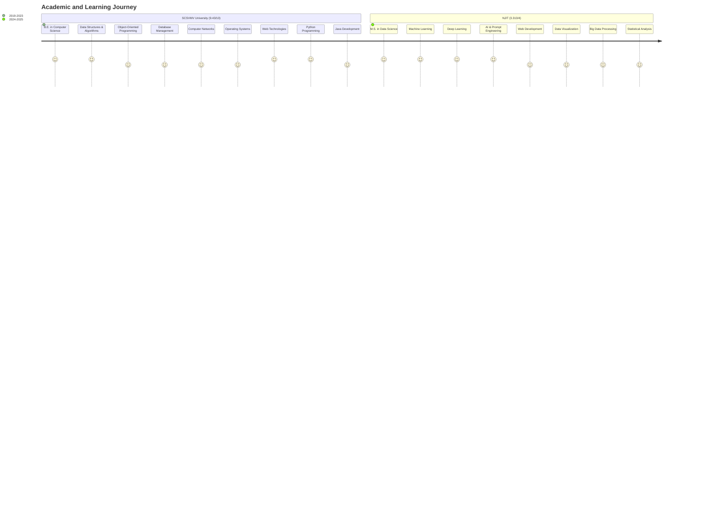
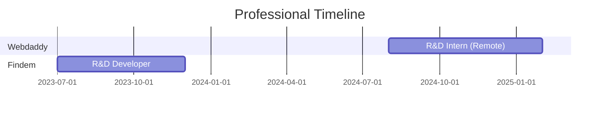
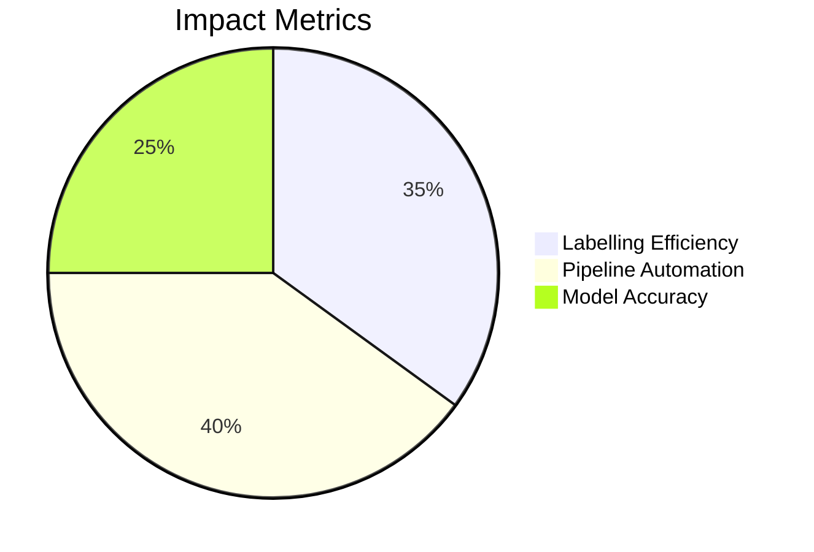
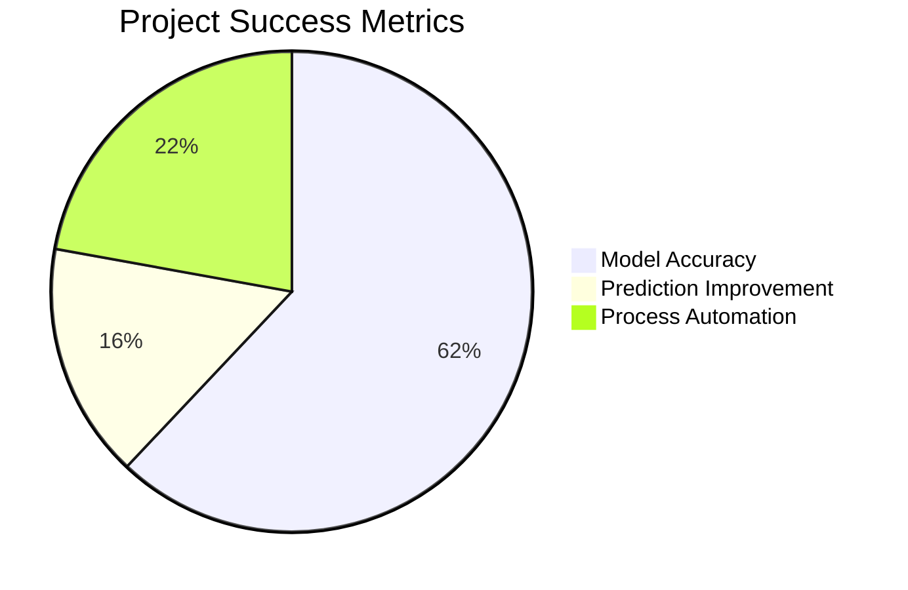
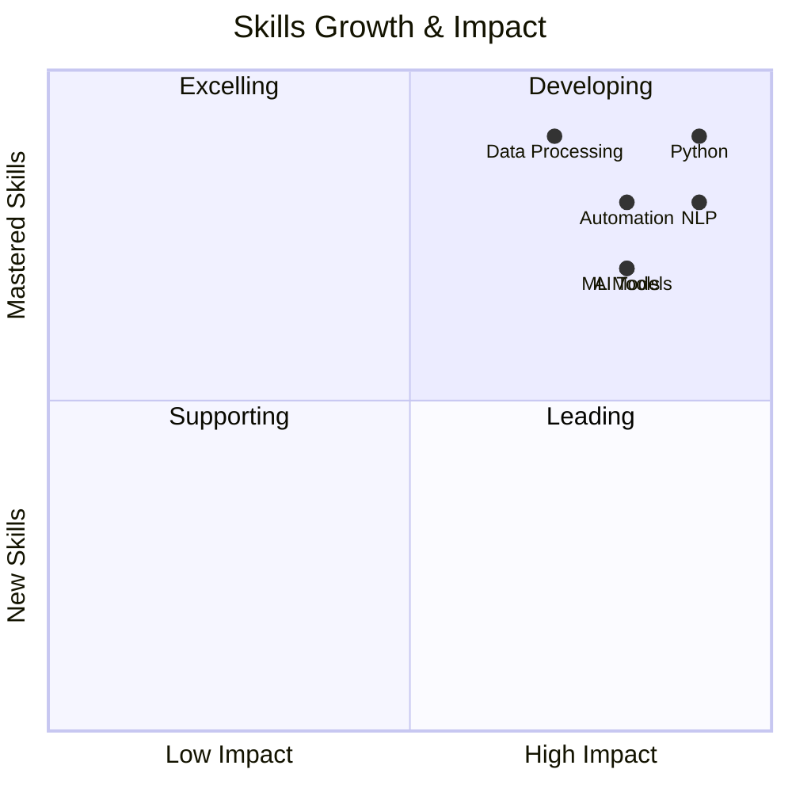
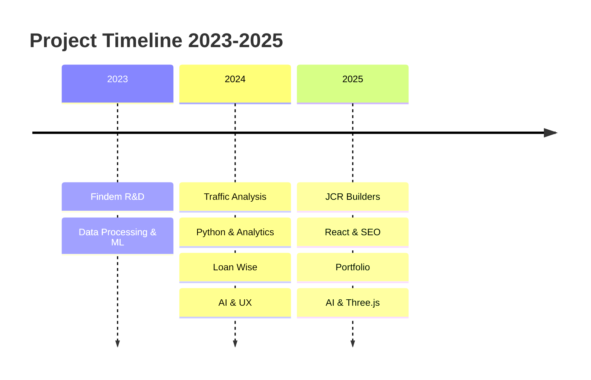
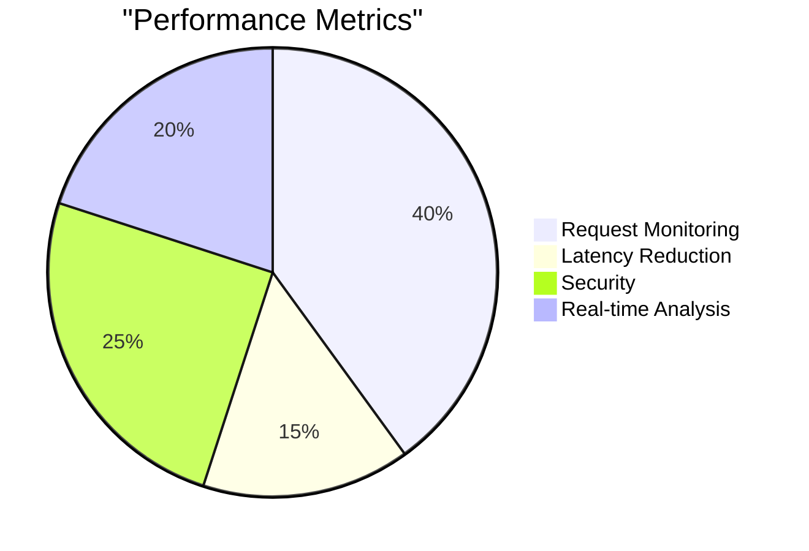
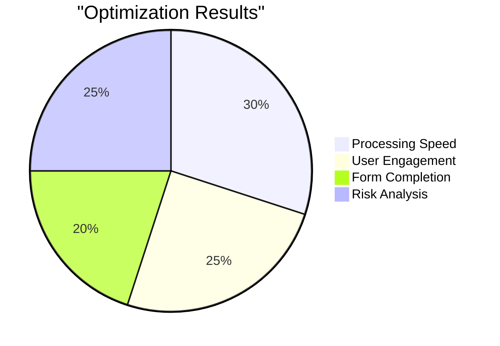
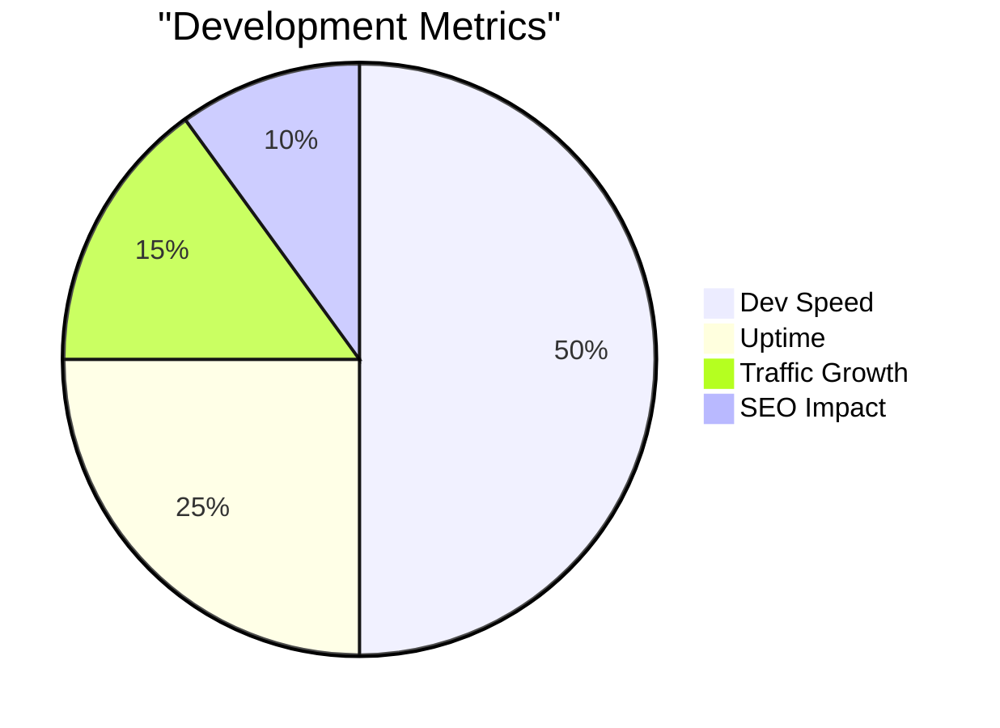
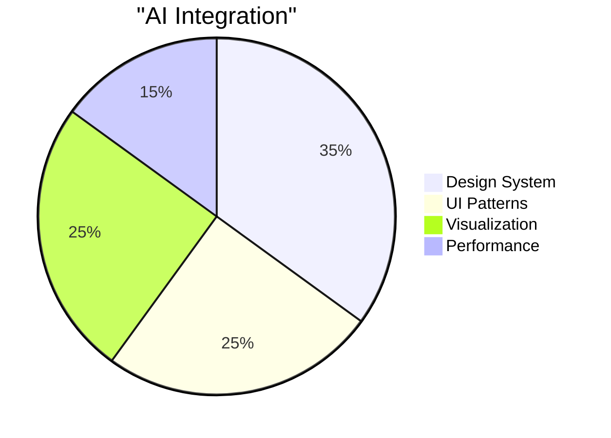

<!-- Banner -->

  

<!-- Badges -->

  
  
  
  

  <h1>🤖 Sai Srinivas Pedhapolla</h1>
  

    <a href="tel:+12017059891">(201) 705-9891</a> • 
    <a href="mailto:pedhapollasaisrinivas@gmail.com">pedhapollasaisrinivas@gmail.com</a>
  

  
<em>Data Science graduate (May 2025) specializing in AI-powered web development, data analysis, and R&D. OPT eligible.</em>

---

### 🎓 Education

📚 Coursework Details

#### NJIT (2024-2025)
- **Core Data Science**
  - Advanced Machine Learning Algorithms
  - Neural Networks & Deep Learning
  - Big Data Analytics & Processing
  - Statistical Methods in Data Science
  
- **AI & Development**
  - AI & Prompt Engineering Techniques
  - Full Stack Development
  - Data Visualization & Analytics
  - Cloud Computing & Distributed Systems

#### SCSVMV (2019-2023)
- **Computer Science Fundamentals**
  - Data Structures & Algorithms
  - Object-Oriented Programming
  - Database Management Systems
  - Computer Networks
  
- **Development & Tools**
  - Web Technologies & Frameworks
  - Python & Java Programming
  - Software Engineering Principles
  - Operating Systems

---

### 💼 Professional Experience

#### Research & Development Intern | Webdaddy | Singapore (Remote)
*Aug 2024 - Feb 2025*

<table>
<tr>
<td width="50%">
<h5>🎯 Key Achievements</h5>
<ul>
<li>🔹 AI-powered annotation tools (35% ↑)</li>
<li>🔹 ML models with TensorFlow & NLP</li>
<li>🔹 Automated pipelines (40% ↑)</li>
<li>🔹 Advanced EDA implementation</li>
</ul>
</td>
<td width="50%">
<h5>💻 Technologies</h5>
<ul>
<li>🔸 Python & TensorFlow</li>
<li>🔸 NLP & ML Pipelines</li>
<li>🔸 Data Analysis Tools</li>
<li>🔸 Automation Scripts</li>
</ul>
</td>
</tr>
</table>

#### Research & Development | Findem, Inc. | Bengaluru
*Jul 2023 - Dec 2023*

<table>
<tr>
<td width="50%">
<h5>🎯 Key Achievements</h5>
<ul>
<li>🔹 Data annotation (98% accuracy)</li>
<li>🔹 Email classification (25% ↑)</li>
<li>🔹 Automated validation tools</li>
<li>🔹 Complex data processing</li>
</ul>
</td>
<td width="50%">
<h5>💻 Technologies</h5>
<ul>
<li>🔸 Python & ML Libraries</li>
<li>🔸 Data Processing Tools</li>
<li>🔸 Validation Frameworks</li>
<li>🔸 Analytics Platforms</li>
</ul>
</td>
</tr>
</table>

---

### 🚀 Projects & Impact

<table>
<tr>
<td width="50%">
<h4>🔍 <a href="https://github.com/saisrinivas194/Traffic-analysis-tool-">Traffic Analysis Tool</a></h4>

- 🔹 10,000+ daily requests monitored
- 🔹 15% latency reduction
- 🔹 5+ endpoints secured

<em>Tech: Python, Data Analysis</em>

</td>
<td width="50%">
<h4>🏦 <a href="https://loanwise.sg">Loan Wise</a></h4>

- 🔹 30% faster processing
- 🔹 25% better engagement
- 🔹 20% lower abandonment

<em>Tech: Tableau, AI, UX</em>

</td>
</tr>
<tr>
<td width="50%">
<h4>🏘️ <a href="https://www.jcrbuilders.in">JCR Builders</a></h4>

- 🔹 50% faster development
- 🔹 95% uptime reliability
- 🔹 150% traffic increase

<em>Tech: ReactJS, ChatGPT, SEO</em>

</td>
<td width="50%">
<h4>🎨 <a href="https://pedhapollasaisrinivas.site">Portfolio Website</a></h4>

- 🔹 AI-assisted design system
- 🔹 Modern UI/UX patterns
- 🔹 Interactive visualizations

<em>Tech: React, AI, Three.js</em>

</td>
</tr>
</table>

### 🛠️ Skills & Technologies

<!-- Programming Languages -->

    <h4>Programming Languages</h4>
    
    
    

<!-- AI & ML -->

    <h4>AI & Machine Learning</h4>
    
    
    

<!-- Web Development -->

    <h4>Web Development</h4>
    
    
    

<!-- Tools & Platforms -->

    <h4>Tools & Platforms</h4>
    
    
    

### 🌐 Languages

<table>
<tr>
<td align="center">

 
<small>Professional Working</small>
</td>
<td align="center">

 
<small>Native Speaker</small>
</td>
<td align="center">

 
<small>Professional Working</small>
</td>
<td align="center">

 
<small>Basic Understanding</small>
</td>
</tr>
</table>

---

### 📬 Connect With Me

  
  
  
  

  

> *"Transforming Data into Intelligence through AI Innovation"*

