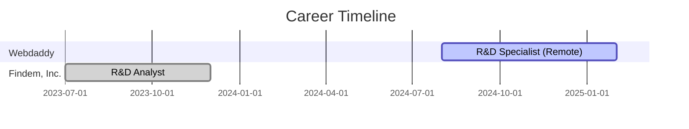

<!-- Animated Banner -->

  

<!-- Typing Name Animation -->

  

---

<!-- Profile Summary -->
### 💼 Who Am I?
🚀 **Data Analyst turned Python Engineer**, leveraging data science, automation, and AI to craft intelligent tools and dashboards. From building ML pipelines to visualizing insights that drive strategy — I'm passionate about transforming raw data into actionable intelligence. OPT Eligible — Graduating May 2025.

---

<!-- Animated Skills Section -->
### ⚙️ My Tech Arsenal

  

---

<!-- Experience Timeline Animation -->
### 🧠 Experience

---

### 🚀 Key Projects (AI + Analytics Focus)

| Project | Tech Stack | Highlights |
|--------|------------|-----------|
| [🔗 Real Estate AI](https://www.jcrbuilders.in/) | React, ChatGPT, SEO | Boosted traffic by 150%, cut dev time 50% |
| [📊 Traffic Monitor](https://github.com/saisrinivas194/Traffic-analysis-tool-) | Python, Dash | 10K+ requests analyzed daily, latency ⬇ 15% |
| 🍲 Recipe Health Dashboard | Python, Plotly Dash | Modeled nutrition from 10K+ recipes |
| 📈 Stock Forecasting | scikit-learn, TensorFlow | Achieved 85% prediction accuracy |
| 🎬 [Netflix Analysis](https://github.com/saisrinivas194/Netflix-Movies-and-TV-shows-analysis) | EDA, Time Series | Enhanced recommendation engine logic |

---

### 📜 Certifications
- ✅ Python (Basic) — HackerRank *(July 2025)*
- 🎓 Data Science — ExcelR *(April 2024)*

---

<!-- Stats Section with Glow Effect -->
### 📊 GitHub Performance

  
  
  

---

### 🎯 Focus Areas

  
  
  
  

---

### 📫 Connect with Me

  
  
  
  

---

  <i>"Transforming data into intelligence using AI, automation, and smart dashboards."</i>

