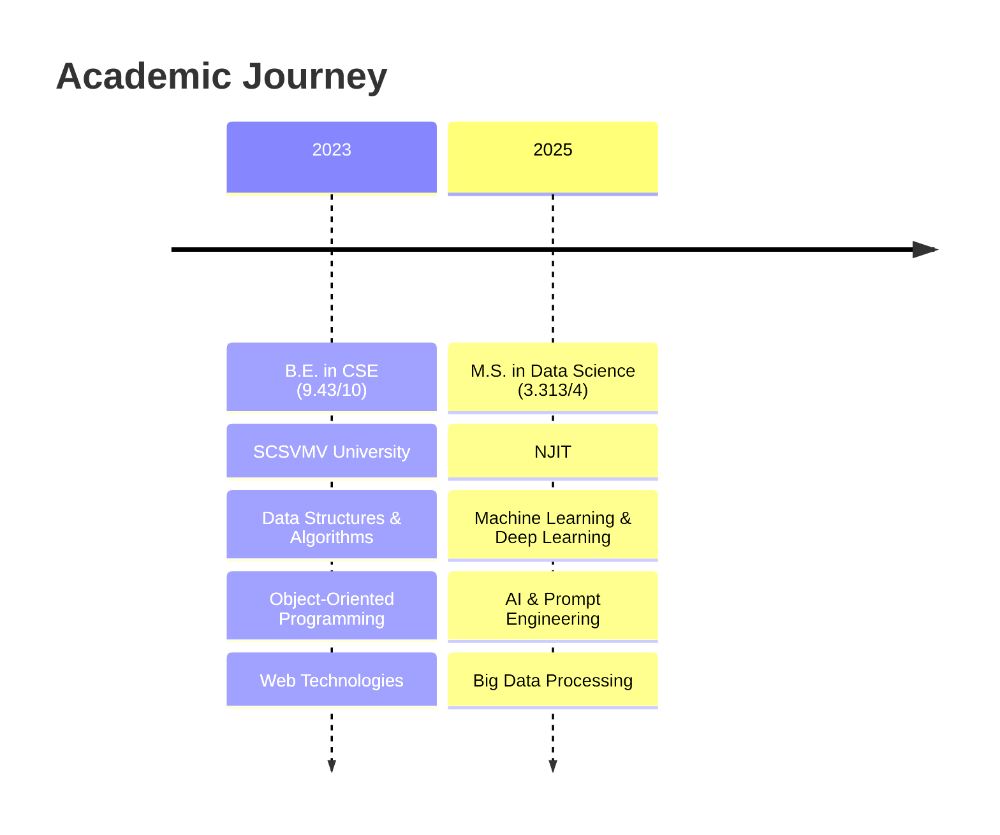
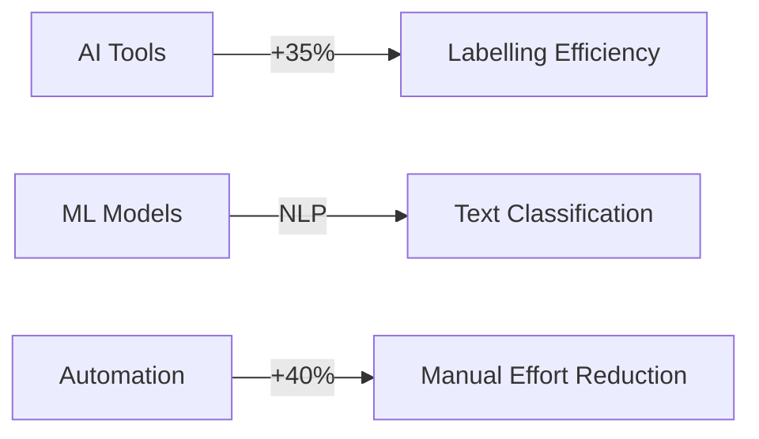
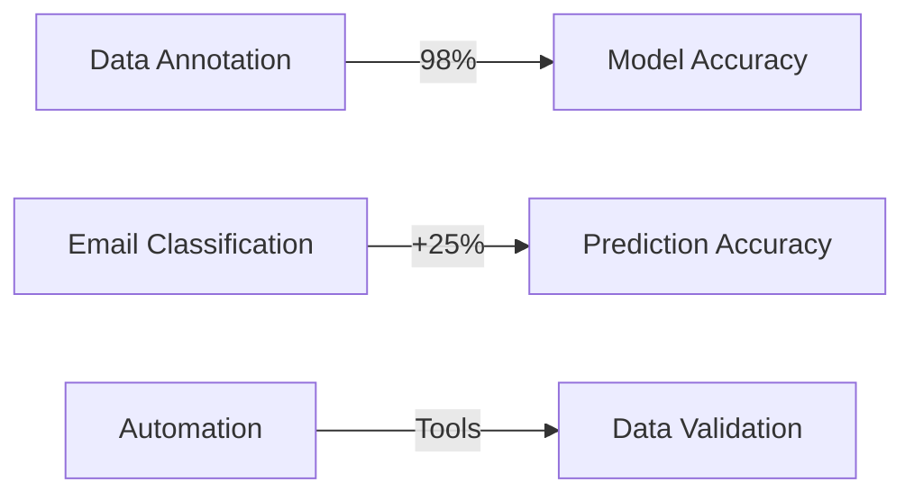

<!-- Banner -->

  

<!-- Badges -->

  
  
  
  

  <h1>🤖 Sai Srinivas Pedhapolla</h1>
  

    <a href="tel:+12017059891">(201) 705-9891</a> • 
    <a href="mailto:pedhapollasaisrinivas@gmail.com">pedhapollasaisrinivas@gmail.com</a>
  

  
<em>Data Science graduate (May 2025) specializing in AI-powered web development, data analysis, and R&D. OPT eligible.</em>

---

### 🎓 Education

---

### 💼 Professional Experience

#### Research & Development Intern | Webdaddy | Singapore (Remote)
*Aug 2024 - Feb 2025*

- 🔹 Developed AI-powered data annotation tools in Python
- 🔹 Built ML models using TensorFlow and NLP
- 🔹 Automated data pipelines with 40% efficiency gain
- 🔹 Conducted comprehensive EDA for trends

#### Research & Development | Findem, Inc. | Bengaluru
*Jul 2023 - Dec 2023*

---

### 🛠️ Technical Skills

💻 Core Competencies

| Category | Skills |
|----------|--------|
| **Programming** | Python (Pandas, NumPy, scikit-learn, TensorFlow, PyTorch), SQL |
| **AI/ML** | Deep Learning, NLP, Computer Vision, Prompt Engineering |
| **Data Analytics** | Tableau, Excel, EDA, Statistical Analysis |
| **Web Development** | ReactJS, HTML/CSS, API Integration |
| **Cloud & Tools** | AWS (Basic), Git, Jupyter, Google Colab |

---

### 🚀 Featured Projects

<table>
<tr>
<td width="33%">
<h4>🔍 <a href="https://github.com/saisrinivas194/Traffic-analysis-tool-">Traffic Analysis Tool</a></h4>

<ul>
<li>10,000+ daily requests monitored</li>
<li>15% latency reduction</li>
<li>5+ endpoints secured</li>
</ul>

<em>Tech: Python, Data Analysis</em>

</td>
<td width="33%">
<h4>🏦 <a href="https://loanwise.sg">Loan Wise</a></h4>

<ul>
<li>30% faster processing</li>
<li>25% better engagement</li>
<li>20% lower abandonment</li>
</ul>

<em>Tech: Tableau, AI, UX</em>

</td>
<td width="33%">
<h4>🏘️ <a href="https://www.jcrbuilders.in">JCR Builders</a></h4>

<ul>
<li>50% faster development</li>
<li>95% uptime reliability</li>
<li>150% traffic increase</li>
</ul>

<em>Tech: ReactJS, ChatGPT, SEO</em>

</td>
</tr>
</table>

---

### 🌐 Languages

| Language | Proficiency |
|----------|------------|
| English | Professional |
| Telugu | Native |
| Hindi | Professional |
| Tamil | Basic |

---

### 📬 Connect With Me

  
  
  
  

  

> *"Transforming Data into Intelligence through AI Innovation"*

