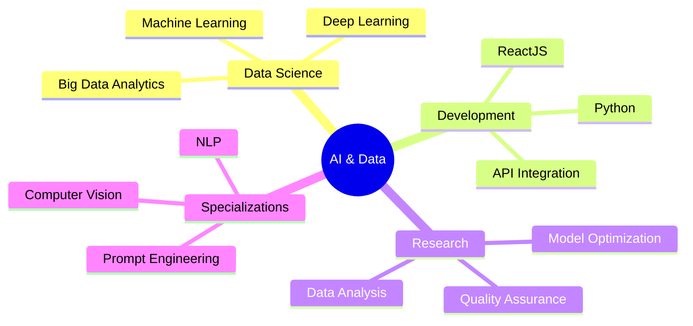
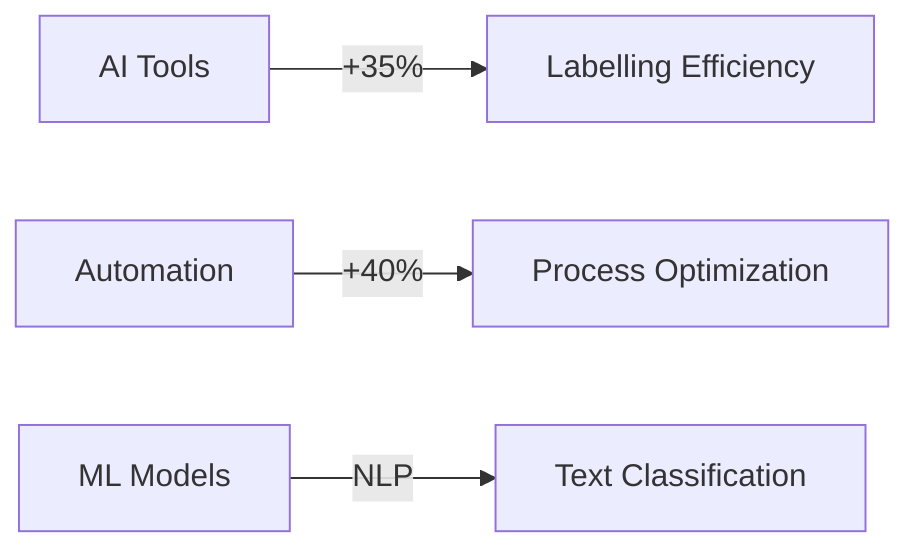
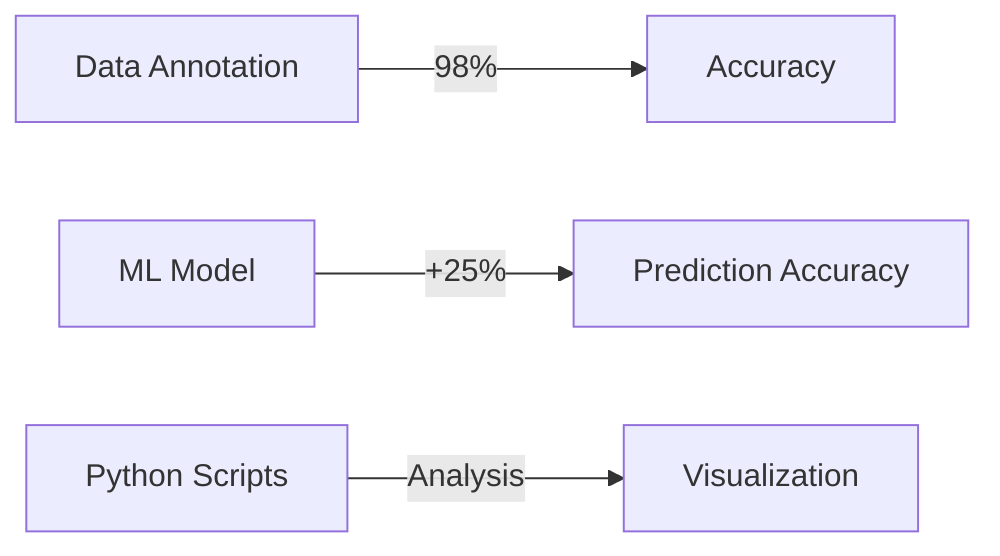
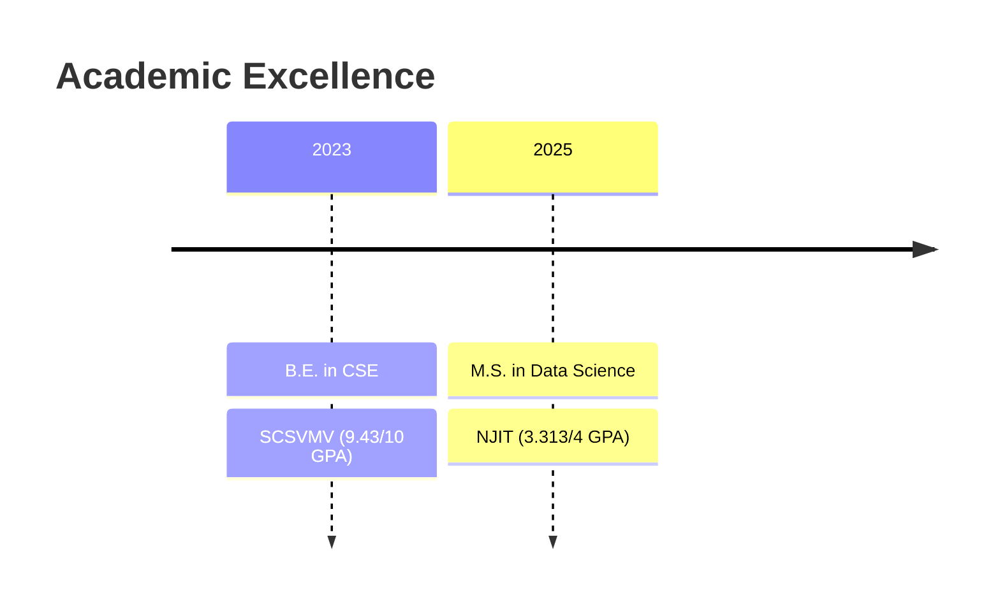

<!-- Banner -->

  

<!-- Badges -->

  
  
  

  <h1>🤖 Sai Srinivas Pedhapolla</h1>
  

    423 Scott mobus pl, Harrison 07029 • <a href="tel:+12017059891">(201) 705-9891</a> • 
    <a href="mailto:pedhapollasaisrinivas@gmail.com">pedhapollasaisrinivas@gmail.com</a>
  

  
<em>Data Science graduate (May 2025) specializing in AI-powered web development, data analysis, and R&D. OPT eligible.</em>

---

### 🎯 Professional Summary

---

### 💼 Experience

#### Research & Development Intern | Webdaddy | Singapore (Remote)
*Aug 2024 - Feb 2025*

- 🔹 Developed AI-powered data annotation tools in Python, improving labelling efficiency by 35%
- 🔹 Built and optimized ML models using TensorFlow and NLP techniques
- 🔹 Automated data pipelines, reducing manual effort by 40%
- 🔹 Conducted comprehensive EDA for trend analysis

#### Research & Development | Findem, Inc. | Bengaluru
*Jul 2023 - Dec 2023*

- 🔹 Managed large-scale data annotation projects with 98% accuracy
- 🔹 Developed Python scripts for complex data analysis
- 🔹 Optimized ML models, improving accuracy by 25%
- 🔹 Created automated validation tools

---

### 🛠️ Technical Skills

💻 Development & Tools

| Category | Skills |
|----------|--------|
| **Languages** | Python (Pandas, NumPy, scikit-learn, TensorFlow, PyTorch), SQL |
| **Web Development** | ReactJS, HTML/CSS, API Integration |
| **Tools & Platforms** | Git, Jupyter, Google Colab, AWS (Basic) |
| **Visualization** | Tableau, Excel, Statistical Analysis |
| **AI/ML** | Deep Learning, NLP, Computer Vision, Prompt Engineering |
| **Quality & Process** | Dataset Curation, Quality Control, AI-Assisted Development |

---

### 📚 Education

**Relevant Coursework:**
- Machine Learning
- Deep Learning
- Big Data Analytics

---

### 🚀 Featured Projects

<table>
<tr>
<td width="33%">
<h4>🔍 Real Traffic Analysis</h4>

<ul>
<li>10,000+ daily requests monitored</li>
<li>15% latency reduction</li>
<li>5+ critical endpoints secured</li>
</ul>
</td>
<td width="33%">
<h4>🏦 Loan Wise</h4>

<ul>
<li>30% faster processing</li>
<li>25% better engagement</li>
<li>20% lower abandonment</li>
</ul>
</td>
<td width="33%">
<h4>🏘️ AI Real Estate</h4>

<ul>
<li>50% faster development</li>
<li>95% uptime reliability</li>
<li>150% local traffic boost</li>
</ul>
</td>
</tr>
</table>

---

### 🌐 Languages

| Language | Proficiency |
|----------|------------|
| English | Professional |
| Telugu | Native |
| Hindi | Professional |
| Tamil | Basic |

---

### 📜 Certifications

- Data Science Certification (ExcelR, 2024)

---

### 📬 Contact

  
  
  

  

> *"Transforming Data into Intelligence through AI Innovation"*

