```mermaid
graph TB
    classDef default fill:#000000,stroke:#333,stroke-width:2px,color:#ffffff;

    subgraph Current Projects
    A[AI Systems] --> B[ML Models]
    A --> C[Data Pipelines]
    B --> D[35% Accuracy ↑]
    C --> E[40% Efficiency ↑]
    end
```

<!-- Banner -->

  

  

  

    
    
  

  
  
  
  

  <h3>💫 About Me</h3>
  
Data Science graduate (May 2025) specializing in AI-powered web development, data analysis, and R&D. OPT eligible.

  
  

 

  

### 🎓 Education

  <table>
    <tr>
      <td align="center">
        
         
        
         
        
         
        <small>Key Courses: Machine Learning, Deep Learning, Data Mining, Big Data</small>
      </td>
      <td align="center">
        
         
        
         
        
         
        <small>Focus: AI, Data Structures, Algorithms</small>
      </td>
    </tr>
  </table>

### 🚀 Projects & Experience

  <!-- Professional Experience -->
  <h3>💼 Professional Experience</h3>
  
  <!-- Current Role -->
  

    <h4>
      
      
    </h4>
  

🔹 Developed AI-powered data annotation tools, improving efficiency by 35%
🔹 Built ML models for text classification using TensorFlow
🔹 Automated data pipelines, reducing manual effort by 40%
🔹 Conducted EDA to improve model accuracy

  <!-- Previous Role -->
  

    <h4>
      
      
    </h4>
  

🔹 Managed data annotation projects with 98% accuracy
🔹 Developed Python scripts for complex data analysis
🔹 Improved email classification accuracy by 25%
🔹 Created automated data validation tools

  <!-- Featured Projects -->
  <h3 align="center">🌟 Featured Projects</h3>
  
  <!-- AI Real Estate -->
  

    <h4>
      
      
    </h4>
  

🔹 Built responsive website using AI-generated code & SEO best practices
🔹 50% faster development through AI-assisted programming
🔹 Integrated Google Maps API, boosting local traffic by 150%
🔹 Achieved 95% uptime reliability

  <!-- Traffic Analysis -->
  

    <h4>
      
      
    </h4>
  

🔹 Analyzed 10,000+ daily requests for traffic patterns
🔹 Reduced latency by 15% through protocol optimization
🔹 Enhanced security across 5+ critical endpoints
🔹 Built real-time diagnostic dashboards

  <!-- Loan Wise -->
  

    <h4>
      
      
    </h4>
  

🔹 Cut loan processing time by 30% through R&D
🔹 Boosted user engagement by 25% with AI content
🔹 Reduced form abandonment by 20%
🔹 Created risk assessment dashboards

  <!-- Data Science Projects -->
  <h3>🤖 Data Science Portfolio</h3>
  

    
    
  

  <!-- Skills -->
  <h3>🛠️ Technical Skills</h3>
  
  <!-- Programming & Data Science -->
  <h4>💻 Programming & Data Science</h4>
  

    
    
    
    
    
    
  

  <!-- AI & ML -->
  <h4>🤖 AI & Machine Learning</h4>
  

    
    
    
    
  

  <!-- Web Development -->
  <h4>🌐 Web Development</h4>
  

    
    
    
    
  

  <!-- Tools & Cloud -->
  <h4>🛠️ Tools & Cloud</h4>
  

    
    
    
    
  

  <!-- Connect -->
  <h3>🔗 Let's Connect</h3>
  

    
    
    
    
    
    
  

---

  <i>📍 423 Scott mobus pl, Harrison 07029 • OPT Eligible • Data Science Graduate (May 2025)</i>

### 📊 Current Stats

  

  

  <h4>🎯 Current Focus Areas</h4>
  

    
    
    
  

---

  <i>"Transforming Data into Intelligence through AI Innovation"</i>

