```mermaid
graph TB
    classDef default fill:#000000,stroke:#333,stroke-width:2px,color:#ffffff;

    subgraph Current Projects
    A[AI Systems] --> B[ML Models]
    A --> C[Data Pipelines]
    B --> D[35% Accuracy ↑]
    C --> E[40% Efficiency ↑]
    end
```

<!-- Banner -->

  

  

  

    
    
  

  
  
  
  

  <h3>💫 About Me</h3>
  
Data Science graduate (May 2025) specializing in AI-powered web development, data analysis, and R&D. OPT eligible.

  
  

 

  

### 🎓 Education

  <table>
    <tr>
      <td align="center">
        
         
        
         
        
         
        <small>Key Courses: Machine Learning, Deep Learning, Data Mining, Big Data</small>
      </td>
      <td align="center">
        
         
        
         
        
         
        <small>Focus: AI, Data Structures, Algorithms</small>
      </td>
    </tr>
  </table>

### 🚀 Projects & Experience

  <!-- Professional Experience -->
  

    <h3>💼 Professional Experience</h3>
    
    <!-- Current Role -->
    

      <h4>
        
        
      </h4>
      <ul align="left">
        <li>🔹 Developed AI-powered data annotation tools, improving efficiency by 35%</li>
        <li>🔹 Built ML models for text classification using TensorFlow</li>
        <li>🔹 Automated data pipelines, reducing manual effort by 40%</li>
        <li>🔹 Conducted EDA to improve model accuracy</li>
      </ul>
    

    <!-- Previous Role -->
    

      <h4>
        
        
      </h4>
      <ul align="left">
        <li>🔹 Managed data annotation projects with 98% accuracy</li>
        <li>🔹 Developed Python scripts for complex data analysis</li>
        <li>🔹 Improved email classification accuracy by 25%</li>
        <li>🔹 Created automated data validation tools</li>
      </ul>
    

  

  <!-- Featured Projects -->
  

    <h3>🌟 Featured Projects</h3>
    
    <!-- AI Real Estate -->
    

      <h4>
        
        
      </h4>
      <ul align="left">
        <li>🚀 Built responsive website using AI-generated code & SEO best practices</li>
        <li>🚀 50% faster development through AI-assisted programming</li>
        <li>🚀 Integrated Google Maps API, boosting local traffic by 150%</li>
        <li>🚀 Achieved 95% uptime reliability</li>
      </ul>
    

    <!-- Traffic Analysis -->
    

      <h4>
        
        
      </h4>
      <ul align="left">
        <li>📊 Analyzed 10,000+ daily requests for traffic patterns</li>
        <li>📊 Reduced latency by 15% through protocol optimization</li>
        <li>📊 Enhanced security across 5+ critical endpoints</li>
        <li>📊 Built real-time diagnostic dashboards</li>
      </ul>
    

    <!-- Loan Wise -->
    

      <h4>
        
        
      </h4>
      <ul align="left">
        <li>💡 Cut loan processing time by 30% through R&D</li>
        <li>💡 Boosted user engagement by 25% with AI content</li>
        <li>💡 Reduced form abandonment by 20%</li>
        <li>💡 Created risk assessment dashboards</li>
      </ul>
    

  

  <!-- Data Science Projects -->
  

    <h3>🤖 Data Science Portfolio</h3>
    

      
      
    

  

  <!-- Skills -->
  

    <h3>🛠️ Technical Skills</h3>
    

      <!-- Programming & Data Science -->
      

        <h4>💻 Programming & Data Science</h4>
        
        
        
        
        
        
      

      <!-- AI & ML -->
      

        <h4>🤖 AI & Machine Learning</h4>
        
        
        
        
      

      <!-- Web Development -->
      

        <h4>🌐 Web Development</h4>
        
        
        
        
      

      <!-- Tools & Cloud -->
      

        <h4>🛠️ Tools & Cloud</h4>
        
        
        
        
      

    

  

  <!-- Connect -->
  

    <h3>🔗 Let's Connect</h3>
    

      
      
      
      
      
    

  

---

  <i>📍 423 Scott mobus pl, Harrison 07029 • OPT Eligible • Data Science Graduate (May 2025)</i>

### 📊 Current Stats

  

  

  <h4>🎯 Current Focus Areas</h4>
  
  
  

---

  <i>"Transforming Data into Intelligence through AI Innovation"</i>

