```mermaid
graph TB
    classDef default fill:#000000,stroke:#333,stroke-width:2px,color:#ffffff;

    subgraph Current Projects
    A[AI Systems] --> B[ML Models]
    A --> C[Data Pipelines]
    B --> D[35% Accuracy ↑]
    C --> E[40% Efficiency ↑]
    end
```

# Sai Srinivas Pedhapolla

  <h3>Data Science Graduate | AI Developer | Full Stack Engineer</h3>
  
Transforming ideas into intelligent solutions through AI and data science

---

## 💼 Professional Experience

<b>Current Role</b>

### R&D Intern @ Webdaddy

-FF6B6B?style=for-the-badge)

- 🔹 Developed AI-powered data annotation tools, improving efficiency by 35%
- 🔹 Built ML models for text classification using TensorFlow
- 🔹 Automated data pipelines, reducing manual effort by 40%
- 🔹 Conducted EDA to improve model accuracy

<b>Previous Role</b>

### R&D Developer @ Findem, Inc.

- 🔹 Managed data annotation projects with 98% accuracy
- 🔹 Developed Python scripts for complex data analysis
- 🔹 Improved email classification accuracy by 25%
- 🔹 Created automated data validation tools

## 🌟 Featured Projects

<b>AI Real Estate Platform</b>

### [JCR Builders](https://www.jcrbuilders.in/)

- 🚀 Built responsive website using AI-generated code & SEO best practices
- 🚀 50% faster development through AI-assisted programming
- 🚀 Integrated Google Maps API, boosting local traffic by 150%
- 🚀 Achieved 95% uptime reliability

<b>Traffic Analysis Tool</b>

### [HTTP/HTTPS Monitor](https://github.com/saisrinivas194/Traffic-analysis-tool-)

- 📊 Analyzed 10,000+ daily requests for traffic patterns
- 📊 Reduced latency by 15% through protocol optimization
- 📊 Enhanced security across 5+ critical endpoints
- 📊 Built real-time diagnostic dashboards

<b>Loan Management System</b>

### [Loan Wise](https://loanwise.sg)

- 💡 Cut loan processing time by 30% through R&D
- 💡 Boosted user engagement by 25% with AI content
- 💡 Reduced form abandonment by 20%
- 💡 Created risk assessment dashboards

## 🛠️ Technical Skills

<b>AI & Machine Learning</b>

<b>Web Development</b>

<b>Tools & Cloud</b>

## 📫 Connect With Me

[_705--9891-Contact-FF6B6B?style=for-the-badge)](tel:+12017059891)

---

  <i>📍 423 Scott mobus pl, Harrison 07029 • OPT Eligible • Data Science Graduate (May 2025)</i>

### 📊 Current Stats

  

  

  <h4>🎯 Current Focus Areas</h4>
  
  
  

---

  <i>"Transforming Data into Intelligence through AI Innovation"</i>

