<!-- Banner -->

  

  

  

    
    
  

  
  
  
  

  <h3>💫 About Me</h3>
  
Data Science graduate (May 2025) specializing in AI-powered web development, data analysis, and R&D. OPT eligible.

  
  

 

  

### 🎓 Education

  <table>
    <tr>
      <td align="center">
        
         
        
         
        
         
        <small>Key Courses: Machine Learning, Deep Learning, Data Mining, Big Data</small>
      </td>
      <td align="center">
        
         
        
         
        
         
        <small>Focus: AI, Data Structures, Algorithms</small>
      </td>
    </tr>
  </table>

### 🚀 Projects

  <!-- Web Development Projects -->
  

    <h4>🌐 Web Development & AI Integration</h4>
    <!-- AI-Powered Real Estate Website -->
    

      
       
      
      
AI-powered real estate platform with 95% uptime and 150% local traffic boost

      <ul>
        <li>Built responsive website using AI-generated code and SEO best practices</li>
        <li>Reduced development time by 50% through AI-assisted programming</li>
        <li>Integrated Google Maps API with location metadata</li>
      </ul>
    

    <!-- Loan Wise -->
    

      
       
      
      
AI-powered loan recommendation platform with optimized workflows

      <ul>
        <li>Reduced loan processing time by 30% through R&D improvements</li>
        <li>Increased user engagement by 25% with AI-driven content strategies</li>
        <li>Reduced form abandonment by 20% through UX improvements</li>
      </ul>
    

  

  <!-- Data Analysis & Traffic Monitoring -->
  

    <h4>📊 Data Analysis & Network Security</h4>
    <!-- Traffic Analysis Tool -->
    

      
       
      
      
Real-time traffic monitoring and security analysis system

      <ul>
        <li>Monitored 10,000+ daily web requests for pattern analysis</li>
        <li>Reduced latency by 15% through protocol optimization</li>
        <li>Built real-time diagnostic dashboards for traffic analysis</li>
      </ul>
    

  

  <!-- Research & Development -->
  

    <h4>🔬 Research & Development</h4>
    <table>
      <tr>
        <td align="center">
          
          
Python-based annotation tools with 35% efficiency boost

        </td>
        <td align="center">
          
          
Email classification with 25% accuracy improvement

        </td>
      </tr>
    </table>
  

  <!-- Data Science Projects -->
  

    <h4>🤖 Machine Learning & Analytics</h4>
    

      
      
    

  

### 💼 Current Role

  
  
   
  

```mermaid
graph TB
    classDef default fill:#000000,stroke:#333,stroke-width:2px,color:#ffffff;

    subgraph Current Projects
    A[AI Systems] --> B[ML Models]
    A --> C[Data Pipelines]
    B --> D[35% Accuracy ↑]
    C --> E[40% Efficiency ↑]
    end
```

### 🌟 Featured Projects

  
  

### 📊 Current Stats

  

  

  <h4>🎯 Current Focus Areas</h4>
  
  
  

---

  <i>"Transforming Data into Intelligence through AI Innovation"</i>

