<!-- Banner -->

  

<!-- Badges -->

  
  
  
  

  <h1>🤖 Sai Srinivas Pedhapolla</h1>
  

    <a href="tel:+12017059891" target="_blank" rel="noopener noreferrer">(201) 705-9891</a> • 
    <a href="mailto:pedhapollasaisrinivas@gmail.com" target="_blank" rel="noopener noreferrer">pedhapollasaisrinivas@gmail.com</a>
  

  
<em>Data Science graduate (May 2025) specializing in AI-powered web development, data analysis, and R&D. OPT eligible.</em>

---

### 🎓 Education Journey

    <h4>🏛️ New Jersey Institute of Technology (2024 - 2025)</h4>
    
    
     
    

    <h4>🎯 Key Courses</h4>
    
    
    
     
    
    
    

    <h4>🏛️ SCSVMV University (2019 - 2023)</h4>
    
    
     
    

    <h4>🎯 Key Courses</h4>
    
    
    
     
    
    
    

### 🔄 Skills Progression Flow

### 📚 Detailed Course Achievements

#### NJIT (2024-2025)

```mermaid
mindmap
    root("Data Science Masters")
        Technical Skills
            Machine Learning Algorithms ⏳
            Deep Neural Networks ⏳
            Natural Language Processing ⏳
            Computer Vision Applications ⏳
        Data Engineering
            Big Data Processing ⏳
            Data Pipeline Development ⏳
            Cloud Computing ⏳
        Analytics
            Statistical Analysis ✓
            Data Visualization ✓
            Predictive Modeling ⏳
        Industry Projects
            Real-time Analytics ⏳
            AI Applications ⏳
            Research Papers ⏳
```

*Legend: ⏳ In Progress | ✓ Completed*

#### SCSVMV (2019-2023)

```mermaid
mindmap
    root("Computer Science B.E.")
        Core Computing
            Data Structures ✓
            Algorithms ✓
            Computer Architecture ✓
        Software Development
            Object-Oriented Programming ✓
            Web Technologies ✓
            Database Management ✓
        Systems
            Operating Systems ✓
            Computer Networks ✓
            System Design ✓
        Projects
            Technical Papers ✓
            Industry Training ✓
            Final Year Project ✓
```

#### Key Achievements
- 🏆 Maintained 9.43/10 GPA in undergraduate studies
- 🎯 Currently maintaining 3.313/4 GPA in graduate studies
- 📝 Published technical papers during undergraduate
- 💻 Completed multiple industry-relevant projects
- 🌟 Specialized in AI and Data Science applications

---

### 💼 Professional Journey

### 🎯 Skill Proficiency Levels

    <!-- Expert Level -->
    
    
     
    <!-- Advanced Level -->
    
    
     
    <!-- Intermediate Level -->
    
    

### 📊 Impact Analysis

### 🚀 Growth Trajectory

### 💼 Professional Experience Details

<h4>🔬 Research & Development Intern | Webdaddy</h4>

<em>Singapore (Freelance) | Aug 2024 - Feb 2025</em>

<h5>🎯 Key Achievements</h5>

<h5>💻 Technical Expertise</h5>

<h4>🔬 Research & Development | Findem, Inc.</h4>

<em>Bengaluru, India | Jul 2023 - Dec 2023</em>

<h5>🎯 Key Achievements</h5>

<h5>💻 Technical Expertise</h5>

### 🚀 Projects & Impact

<table>
<tr>
<td width="50%">
<h4>🔍 <a href="https://github.com/saisrinivas194/Traffic-analysis-tool-">Traffic Analysis Tool</a></h4>

- 🔹 10,000+ daily requests monitored
- 🔹 15% latency reduction
- 🔹 5+ endpoints secured

<em>Tech: Python, Data Analysis</em>

</td>
<td width="50%">
<h4>🏦 <a href="https://loanwise.sg">Loan Wise</a></h4>

- 🔹 30% faster processing
- 🔹 25% better engagement
- 🔹 20% lower abandonment

<em>Tech: Tableau, AI, UX</em>

</td>
</tr>
<tr>
<td width="50%">
<h4>🏘️ <a href="https://www.jcrbuilders.in">JCR Builders</a></h4>

- 🔹 50% faster development
- 🔹 95% uptime reliability
- 🔹 150% traffic increase

<em>Tech: ReactJS, ChatGPT, SEO</em>

</td>
<td width="50%">
<h4>🎨 <a href="https://pedhapollasaisrinivas.site">Portfolio Website</a></h4>

- 🔹 AI-assisted design system
- 🔹 Modern UI/UX patterns
- 🔹 Interactive visualizations

<em>Tech: React, AI, Three.js</em>

</td>
</tr>
</table>

### 🛠️ Skills & Technologies

<!-- Data Science & ML -->

    <h4>Data Science & ML</h4>
    
    
    
    
    

<!-- AI & Analytics -->

    <h4>AI & Analytics</h4>
    
    
    
    

<!-- Data Tools -->

    <h4>Data Tools</h4>
    
    
    
    

<!-- Development -->

    <h4>Web Development</h4>
    
    
    
    

<!-- AI Development -->

    <h4>AI Development</h4>
    
    
    
    

<!-- Development Tools -->

    <h4>Development Tools</h4>
    
    
    
    

### 🌐 Languages

<table>
<tr>
<td align="center">

 
<small>Professional Working</small>
</td>
<td align="center">

 
<small>Native Speaker</small>
</td>
<td align="center">

 
<small>Professional Working</small>
</td>
<td align="center">

 
<small>Basic Understanding</small>
</td>
</tr>
</table>

---

### 📬 Connect With Me

  
  
  
  

  

> *"Transforming Data into Intelligence through AI Innovation"*

