<!-- Banner -->

  

  

  

    
    
  

  
  
  
  

  <h3>💫 About Me</h3>
  
Data Science graduate (May 2025) specializing in AI-powered web development, data analysis, and R&D. OPT eligible.

  
  

 

  

### 🎓 Current Education

  
  
   
  

### 💼 Current Role

  
  
   
  

```mermaid
graph TB
    classDef default fill:#000000,stroke:#333,stroke-width:2px,color:#ffffff;

    subgraph Current Projects
    A[AI Systems] --> B[ML Models]
    A --> C[Data Pipelines]
    B --> D[35% Accuracy ↑]
    C --> E[40% Efficiency ↑]
    end
```

### 🌟 Featured Projects

  
  

### 📊 Current Stats

  

  

  <h4>🎯 Current Focus Areas</h4>
  
  
  

---

  <i>"Transforming Data into Intelligence through AI Innovation"</i>

