```mermaid
%%{init: { 'theme': 'dark', 'themeVariables': { 'fontFamily': 'monospace' }}}%%
graph TB
    classDef default fill:#1A1B27,stroke:#70A5FD,stroke-width:2px,color:#ffffff;

    subgraph 2024-Present
    A[Webdaddy]
    A --> B[R&D Intern]
    B --> C[Singapore]
    B --> D[Projects]
    D --> E[AI Systems]
    D --> F[Data Pipelines]
    D --> G[Automation]
    B --> H[Impact]
    H --> I[35% ML Accuracy ↑]
    H --> J[40% Pipeline Efficiency ↑]
    H --> K[25% Coverage ↑]
    end

    subgraph 2023
    L[Findem Inc.]
    L --> M[R&D Developer]
    M --> N[Bengaluru]
    M --> O[Projects]
    O --> P[Data Processing]
    O --> Q[ML Systems]
    O --> R[Analytics]
    M --> S[Impact]
    S --> T[98% Data Quality]
    S --> U[25% Classification ↑]
    S --> V[35% Efficiency ↑]
    end
```

<!-- Banner -->

  

  

  
  
  
  

  

    
    
  

  
<em>Data Science graduate (May 2025) specializing in AI-powered web development, data analysis, and R&D. OPT eligible.</em>

  

<h2>🎓 Education Journey</h2>

<h2>💼 Professional Journey</h2>

<h2>🎯 Skill Proficiency</h2>

    <!-- Expert Level -->
    
    
     
    <!-- Advanced Level -->
    
    
     
    <!-- Intermediate Level -->
    
    

  

### 📬 Connect With Me

  
  
  
  

  

> *"Transforming Data into Intelligence through AI Innovation"*

